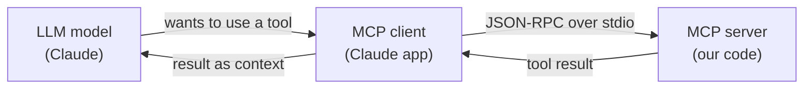
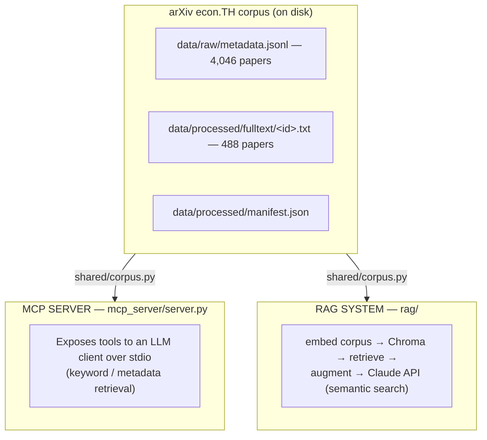
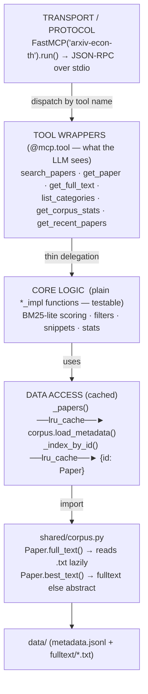
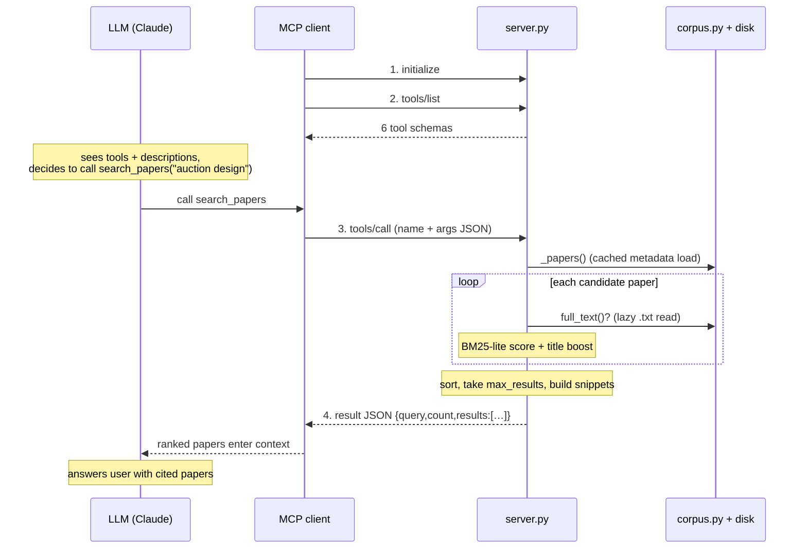
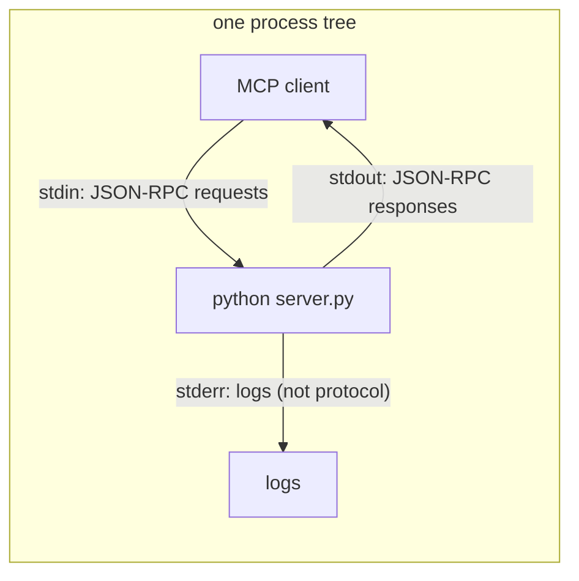

# Architecture — arXiv econ.TH MCP Server

How the MCP (Model Context Protocol) server is built and how a request flows
through it. For the RAG component see [`rag/README.md`](rag/README.md); for the
shared data schema see [`shared/DATA_CONTRACT.md`](shared/DATA_CONTRACT.md).

## 1. What MCP is

MCP is a standard way to give an LLM access to external tools and data. It is a
**client–server** protocol over **JSON-RPC 2.0**. The model never calls our code
directly — an MCP *client* (Claude Desktop, Claude Code, …) sits in between.



The server **advertises tools** (name + description + JSON schema). The model
reads those descriptions, decides which to call and with what arguments; the
client forwards the call; the server executes and returns structured data, which
lands back in the model's context.

## 2. Where this server sits in the project

Both deliverables read the **same corpus** through one shared access layer, but
do different jobs: **MCP = exact/keyword/metadata lookup as live tools**;
**RAG = semantic similarity search + generation**. The MCP server does no
embeddings.



## 3. Internal architecture of the MCP server

Layered, with one key design choice: **tool logic lives in plain `_impl`
functions**, and the FastMCP `@mcp.tool()` wrappers just delegate to them — so
the same logic is testable in-process without going over stdio.



Two caching behaviors matter:

| What | Cached? | Why |
|------|---------|-----|
| Metadata (4,046 papers) | **Yes** — loaded once via `lru_cache` | Stable; loading per-call would be wasteful |
| Full text (`<id>.txt`) | **No** — read from disk each call | Files trickle in as the dataset downloads; lazy reads make newly-extracted papers searchable **without restarting** the server |

## 4. Request lifecycle — a `search_papers` call



Steps 1–2 happen once per session (handshake + discovery); 3–4 repeat per call.

## 5. The six tools (what the model sees)

| Tool | Purpose | Key args | Returns |
|------|---------|----------|---------|
| `search_papers` | Keyword/relevance search | `query`, `max_results`, `category`, `author`, `date_from/to` | ranked `{id,title,authors,score,snippet,abs_url,has_full_text}` |
| `get_paper` | Full metadata for one paper | `paper_id` (bare or `v2`-suffixed) | title, authors, abstract, categories, dates, DOI, links |
| `get_full_text` | Extracted PDF text | `paper_id`, `max_chars` | text (truncated w/ note), or abstract fallback if no PDF |
| `list_categories` | Category distribution | — | `[{category,count}]` desc |
| `get_corpus_stats` | Corpus summary | — | totals, date range, top authors/categories, manifest |
| `get_recent_papers` | Newest papers | `n`, `category` | recent papers, date-desc |

The **descriptions and JSON schemas** are the actual interface — they're what the
model reasons over to pick a tool. That's why each function has a detailed
docstring: the model never sees the implementation, only the description.

## 6. How `search_papers` ranks — BM25-lite

Classic information-retrieval scoring, not embeddings:

```
score(paper, query) = Σ over query terms t:
                                       (k1 + 1) · f(t)
        idf(t)  ×  ──────────────────────────────────────────────   ×  title_boost?
                    f(t) + k1 · (1 − b + b · docLen / avgDocLen)

  idf(t) = ln(1 + (N − n_t + 0.5)/(n_t + 0.5))    N = #papers, n_t = #docs with t
  k1 = 1.5    b = 0.75    title_boost = 2.5× when the term is in the title
  document text = title + abstract (+ full text if extracted, read lazily)
```

Rare-but-frequent-in-the-paper terms score highest, with diminishing returns
(`k1`) and a length penalty (`b`), plus a 2.5× title boost.

## 7. Transport & protocol



- **Transport = stdio.** Running `server.py` directly looks like it "hangs" — it's
  blocking on stdin waiting for JSON-RPC. It's meant to be launched *by a client*.
- **Protocol = JSON-RPC 2.0**: `initialize` → `tools/list` → repeated `tools/call`.
- **FastMCP**: the `@mcp.tool()` decorator auto-generates each tool's JSON schema
  from the function signature, type hints, and docstring.

## 8. Running / registering

```jsonc
{
  "mcpServers": {
    "arxiv-econ-th": {
      "command": "/Users/josealface/AI Projects/Claude/my-projects/arxiv/.venv/bin/python",
      "args": ["/Users/josealface/AI Projects/Claude/my-projects/arxiv/mcp_server/server.py"]
    }
  }
}
```

The client launches that subprocess, runs the `initialize` / `tools/list`
handshake, and the six tools become available to the model.

## 9. MCP vs RAG — when each fires

| | **MCP server** | **RAG system** |
|---|---|---|
| Query style | keyword / metadata / exact id | natural-language / semantic |
| Under the hood | BM25-lite term scoring | vector cosine similarity (MiniLM) |
| State | metadata in memory; text read lazily | persistent Chroma DB (22,133 chunks) |
| Caller | an MCP client/LLM, live, as a tool | CLI / `augment()` / `generate_answer()` |
| Generation? | no — returns data | optional — `--answer` calls Claude |
| Best at | "get paper X", "papers by author Y since 2023" | "what does the literature say about mechanism design under budget constraints" |
